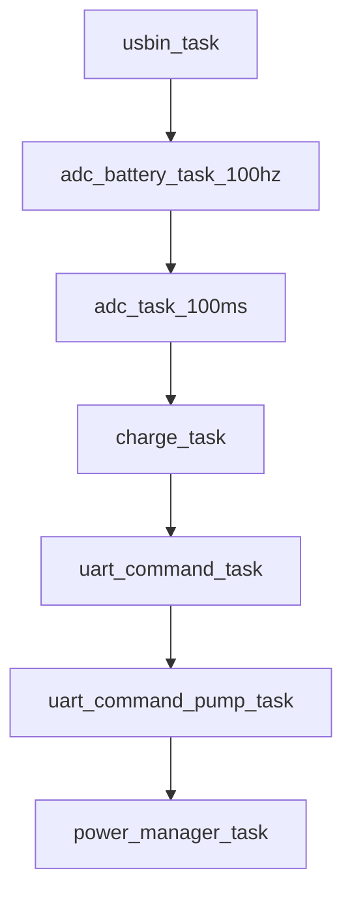
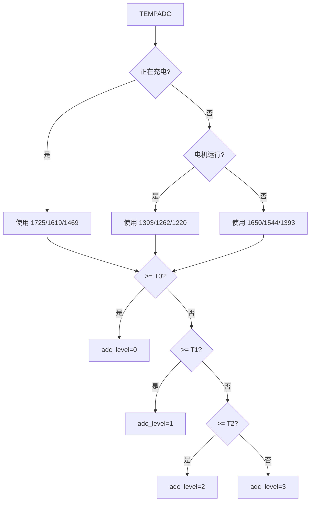
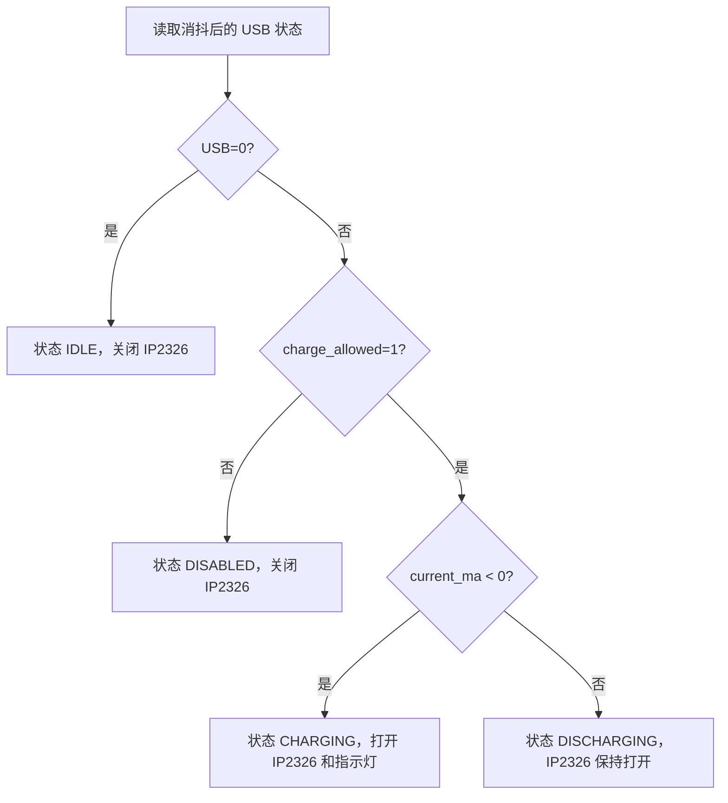
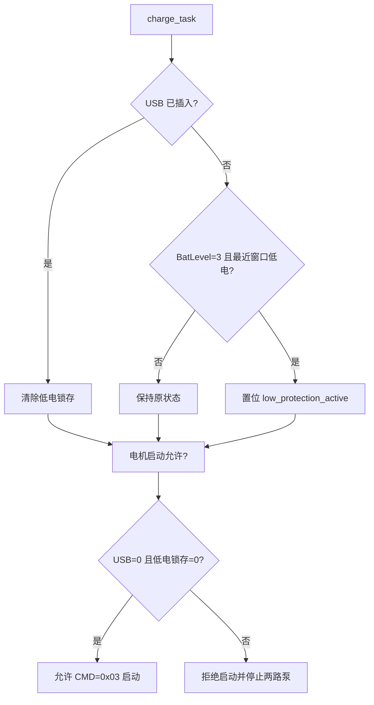
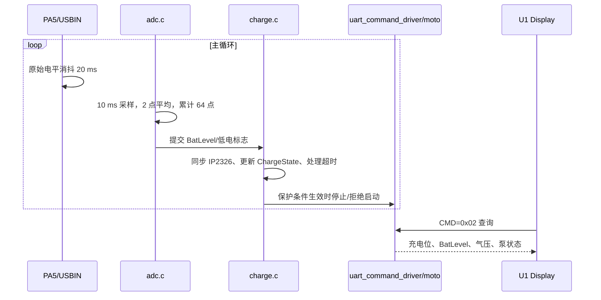

# U2 电池电量与充电控制逻辑

## 1. 责任边界

U2 的 `adc.c` 负责“测量和分档”，`usbin.c` 负责“USB 原始输入消抖”，`charge.c` 负责“充电策略、低电锁存和充电超时”，`uart_command_driver.c` 负责“电机启动拦截以及向 U1 返回状态”。主循环中的调用顺序如下：



`usbin_task()` 必须先于 `charge_task()`，这样充电策略使用的是最新的消抖状态；电池任务必须先于 `charge_task()`，这样低电保护使用的是刚完成的电量平均结果。

## 2. 电池 ADC 采样链路

### 2.1 通道和工程量

| 信号 | MCU 引脚 | 作用 |
|---|---|---|
| 电池电压 | PA3 / ADC1_CH1 | 计算 `BatLevel`，同时换算 `g_adc_data.battery_mv` |
| 充电电流 | PA4 / ADC1_CH2 | `current_ma < 0` 表示电流流入电池 |
| 电机电压 | PB0 / ADC1_CH7 | 100 ms 低速监测 |
| 12 V 电压 | PB1 / ADC1_CH0 | 100 ms 低速监测 |

PA4 的当前换算式为：

```text
current_ma = (current_pin_mv - 1650) × 10
```

其中 `1650 mV` 是零电流基准，具体硬件校准参数位于 `U2/control/Inc/py32_u1_hw_config.h`。

### 2.2 运行时平均

`adc_battery_task_100hz()` 每 10 ms 运行一次，实际处理流程为：


因此运行时一个完整 `TEMPADC` 使用 `2 × 64 = 128` 个 ADC 原始样本，理论周期约为 `10 ms × 128 = 1.28 s`。如果充电状态或电机运行状态改变，当前 64 点窗口会清零并按新上下文重新累计，避免静置电压和带载电压混在一起。

上电时 `adc_battery_startup_sample()` 会连续调用 128 次原始采样并直接初始化首个电量等级。这里是“连续读取”，函数本身没有在每次读取之间插入 10 ms 延时；它的作用是尽快建立初值，而不是模拟运行时 1.28 s 的时间窗口。

## 3. 电量分档

### 3.1 档位定义

| `BatLevel` | 业务含义 | U1 图标格数（非充电） |
|---:|---|---:|
| 0 | 满电 | 3 |
| 1 | 较高电量 | 2 |
| 2 | 较低电量 | 1 |
| 3 | 低电/空电 | 0，仅显示外框 |

这是“数值越小越满”的反向编码。U2 内部所有保护和协议均使用这个编码。

### 3.2 阈值表

阈值是 12 位 ADC 原始码，不是电压值，也不是百分比。判定顺序为：`>= 第1阈值` 得 0，`>= 第2阈值` 得 1，`>= 第3阈值` 得 2，否则得 3。

| 上下文 | 第 1 阈值 | 第 2 阈值 | 第 3 阈值 |
|---|---:|---:|---:|
| 静置 `normal` | 1650 | 1544 | 1393 |
| 电机运行 `work` | 1393 | 1262 | 1220 |
| 正在充电 `charge` | 1725 | 1619 | 1469 |



### 3.3 单向更新规则

`adc_battery_apply_average()` 将本次平均得到的 `adc_level` 与当前 `s_battery_level` 比较，每个完整平均窗口最多改变一级：

| 当前外部状态 | 允许的方向 | 代码行为 |
|---|---|---|
| 正在充电（`current_ma < 0`） | 向 0 方向 | `adc_level < 当前值` 时减 1 |
| USB 未插入 | 向 3 方向 | `adc_level > 当前值` 时加 1 |
| USB 已插入但未检测到负电流 | 保持 | 不改变当前等级 |

上电首个窗口使用 `force_initial=1`，直接写入分档结果，不受单向限制；否则默认值可能把满电设备卡在低电档。充电状态切换或电机状态切换只影响后续窗口的上下文，不会在切换瞬间直接改电量。

## 4. USB 消抖与充电状态

`usbin.c` 将 PA5 配置为下拉输入，高电平表示 USB 插入。原始电平变化后，必须连续稳定 `20 ms` 才提交 `usb_stable_state`，并同步控制 IP2326 的使能脚 PA2。

`charge.c` 的状态计算如下：

| USB 消抖状态 | 软件允许充电 | 电流 | `ChargeState` | IP2326 输出 |
|---:|---:|---:|---|---:|
| 0 | 任意 | 任意 | `IDLE` | 关 |
| 1 | 1 | `< 0` | `CHARGING` | 开 |
| 1 | 1 | `>= 0` | `DISCHARGING` | 开 |
| 1 | 0 | 任意 | `DISABLED` | 关 |

`CHARGE_STATE_FAULT` 目前只是预留枚举，现有代码不会主动产生该状态。协议层只把 `CHARGING` 映射为充电位 1，其他状态均返回 0。



## 5. 充电最长时间

只有 `charge_state == CHARGE_STATE_CHARGING` 时才累加超时计数。代码每隔 `1024 ms` 增加一次计数，达到 `21600` 次后执行一次 `adc_battery_charge_timeout_step()`，将电量等级向满电方向推进一级，然后把超时计数清零：

```text
21600 × 1024 ms = 22,118,400 ms ≈ 6.14 h
```

它不会一次性把电量强制写成 0，也不会绕过充电状态；如果 USB 拔出、电流不再为负或系统复位，计时器都会清零。

## 6. 低电保护和电机保护

### 6.1 低电锁存

当 USB 未插入，且最近一次完整平均同时满足 `adc_level == 3`（`s_battery_low=1`）时，`charge_task()` 置位 `low_protection_active`。USB 插入后立即清除该锁存；USB 仍插入期间，电机依然禁止启动。



### 6.2 两层电机拦截

1. **启动入口拦截**：收到 `CMD=0x03` 时，必须同时满足 USB 未插入、低电锁存未置位、目标压力有效、模式有效、传感器去皮完成。
2. **运行中拦截**：`uart_command_task()` 每轮先执行 `uart_command_enforce_motor_protection()`；如果保护条件失效，清除 `g_uart_pump_running` 并调用 `moto_stop()`。随后 `uart_command_pump_task()` 还会再次检查，形成双重保护。

因此“插入 USB”或“进入低电保护”不需要等待 U1 下一秒的状态查询，就能在 U2 本地停止泵。

## 7. U2 主循环中的完整时序



## 8. 当前实现的边界

- 旧的百分比转换接口仍保留，但没有注册转换回调时返回 `0xFF`；当前 `CMD=0x02` 不调用该接口。
- ADC 转换失败会进入 `APP_ErrorHandler()` 死循环，当前没有自动重试或故障降级。
- `charge_enable()`/`charge_disable()` 是软件策略接口；USB 插入状态仍由 `usbin.c` 的消抖结果决定。
