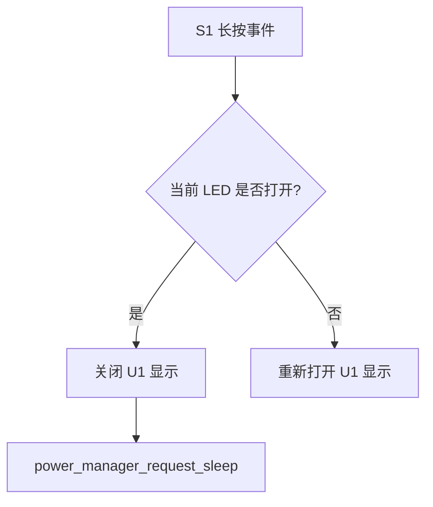
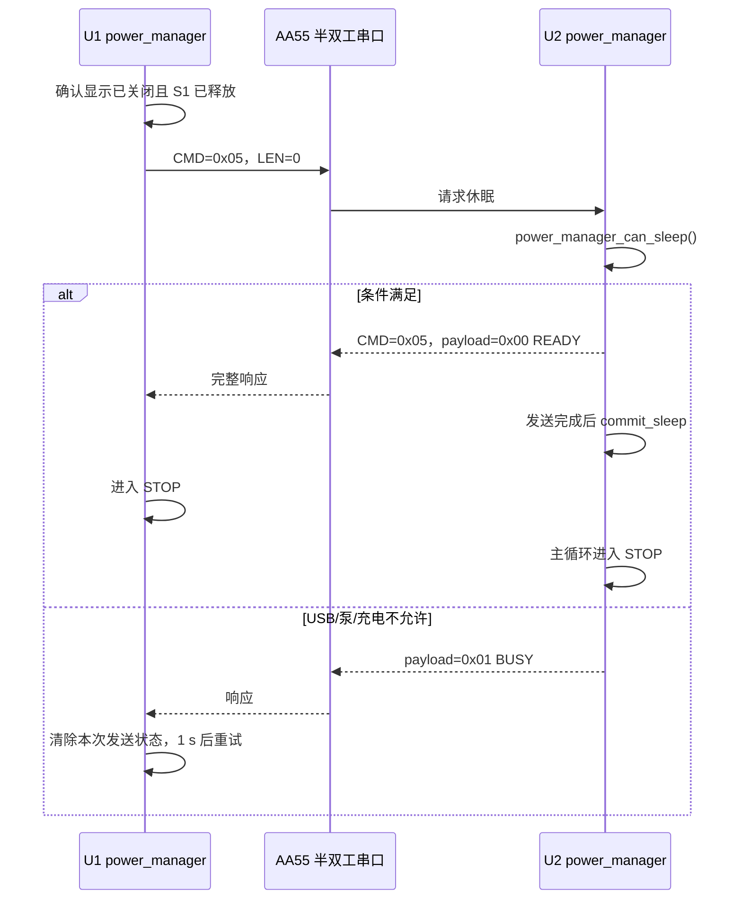
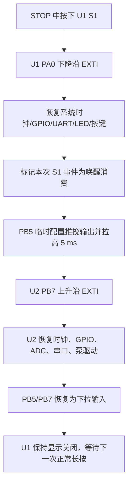
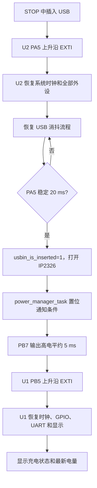

# U1/U2 休眠与唤醒逻辑

## 1. 硬件和软件角色

| 功能 | 芯片 | 引脚 | 运行态配置 | STOP 唤醒配置 |
|---|---|---|---|---|
| 电源键 S1 | U1 | PA0 | LED/按键复用线 | 上拉输入、下降沿 EXTI |
| U1 共享唤醒 | U1 | PB5 | 下拉输入 | 下拉输入、上升沿 EXTI |
| USB 插入 | U2 | PA5 | 下拉输入 | 下拉输入、上升沿 EXTI |
| U2 共享唤醒 | U2 | PB7 | 下拉输入 | 下拉输入、上升沿 EXTI |

U1 PB5 和 U2 PB7 是同一根 `WK_UP` 硬件线。休眠时双方均为下拉输入；已经被本地事件唤醒的一方才暂时切换成推挽输出，拉高约 5 ms，然后立即恢复下拉输入。

## 2. 进入休眠的触发和握手

### 2.1 U1 长按识别

U1 `key_scan()` 每 10 ms 采样一次，输入连续稳定 30 ms 后才确认状态变化。S1 长按阈值为 800 ms，长按事件由 `display_control_scan()` 消费：



`power_manager_request_sleep()` 只在 U1 显示已经关闭、且当前没有正在 STOP 时置位 `s_sleep_requested`。代码没有启用“普通运行空闲 60 秒自动休眠”计时器。

### 2.2 U1 发送 CMD=0x05

U1 `power_manager_task()` 等待 S1 释放后才继续，避免用户一直按住按键导致刚进入 STOP 就再次被唤醒。请求流程每 1 s 重试一次：



U1 串口事务超时时间为 100 ms；无效响应、超时或发送失败都不会直接进入 STOP。

### 2.3 U2 的实际休眠条件

`power_manager_can_sleep()` 当前只检查四项：

```text
usbin_read_raw() == 0
usbin_is_inserted() == 0
g_uart_pump_running == 0
charge_get_state() != CHARGE_STATE_CHARGING
```

也就是说，U2 要同时看到 USB 原始电平为低、消抖状态为未插入、压力泵停止、状态不是 `CHARGING`。代码没有另外检查“串口事务忙”“传感器校准状态”等条件；串口握手本身通过“先回复、后提交”保证响应能完整发出。

## 3. 进入 STOP 前的处理

### 3.1 U1

`U1/Display/Src/power_manager.c` 的 `power_enter_stop()` 依次执行：

1. 关闭显示总开关；
2. 挂起 U1/U2 控制串口；
3. 将显示矩阵相关 GPIO 切换为模拟输入以降低漏电；
4. 将 PA0 配置为 S1 下降沿 EXTI、PB5 配置为共享线上升沿 EXTI；
5. 再次检查 S1 是否仍被按下、共享线是否为高；
6. 关闭 SysTick，执行 `HAL_PWR_EnterSTOPMode(..., WFI)`。

### 3.2 U2

`U2/control/Src/power_manager.c` 的 `power_enter_stop()` 依次执行：

1. 停止两路泵并反初始化 TIM1；
2. 停止 ADC、软件串口、U2 控制串口；
3. 关闭 IP2326、工作灯和充电指示灯；
4. 将普通 GPIO 切换为模拟输入；
5. 将 PA5、PB7 配置为下拉输入加上升沿 EXTI；
6. 再次检查唤醒标志、USB 电平和共享线电平；
7. 关闭 SysTick，执行 STOP/WFI。

两颗 MCU 都使用“检查—关中断—再次检查—WFI”的最后窗口处理，避免在最后一次电平检查和 WFI 之间丢失唤醒边沿。

## 4. 两条唤醒路径

### 4.1 S1 唤醒：U1 先醒，再通知 U2



U1 通过 `s_suppress_s1`、`s_suppress_s1_seen_pressed` 和 200 ms 截止时间屏蔽唤醒用的这次 S1 按下/释放，避免误触发泵切换或显示切换。U2 被共享线唤醒时不会自动启动压力泵。

### 4.2 USB 唤醒：U2 先醒，再通知 U1



U2 本地唤醒后先恢复 `usbin_init()`，再等待 PA5 经过消抖确认；只有 `usbin_is_inserted()!=0` 时才发送共享唤醒脉冲。因此瞬态插拔不会直接唤醒 U1 并点亮充电界面。

## 5. 唤醒后的恢复顺序

### U1 `power_enter_stop()` 返回后

```text
恢复系统时钟
 -> 关闭 EXTI 并恢复运行态 GPIO
 -> key_init()
 -> led_init()
 -> uart_control_resume()
 -> 根据唤醒原因决定显示是否打开
 -> 如为 S1 本地唤醒，屏蔽 S1 事件并脉冲 WK_UP
```

共享线唤醒 U1（通常来自 USB）会打开显示；S1 本地唤醒则保持显示关闭。

### U2 `power_enter_stop()` 返回后

```text
恢复系统时钟
 -> 恢复 PA5/PB7 运行态输入
 -> led_init / ip2326_init / usbin_init
 -> soft_uart_resume / wf183d_resume / uart_command_resume
 -> moto_resume / adc_resume / charge_init
 -> 如为 PA5 本地唤醒，等待 USB 消抖后通知 U1
```

STOP 是低功耗停机，不是系统复位；但当前恢复函数会重新初始化多个驱动，因此应把它看成“保留 RAM 的外设重建流程”。压力泵不会因为恢复流程自动启动。

## 6. 共享 WK_UP 线安全规则

1. 休眠状态双方均为输入下拉，默认低电平。
2. 只有已经被本地事件唤醒的一方驱动共享线。
3. 驱动前检查线路仍为低，避免两个方向同时驱动。
4. 先把输出数据寄存器写成高，再切换为推挽输出，减少毛刺。
5. 高电平保持约 5 ms，随后立即恢复输入下拉。
6. 被通知的一方只响应上升沿，不反向持续驱动共享线。

## 7. 当前实现边界

- 第一版 STOP 唤醒源只有 U1 S1 和 U2 USB 插入；S2/S3/S4/S5/S6 不直接作为 STOP 唤醒源。
- U1 S1 与 LED 矩阵复用，只有关闭矩阵扫描并固定为上拉输入后才能作为独立唤醒脚。
- 真实 STOP 电流、WK_UP 脉冲宽度、USB 插入和按键联动仍应在目标板上用示波器和功耗仪确认。
