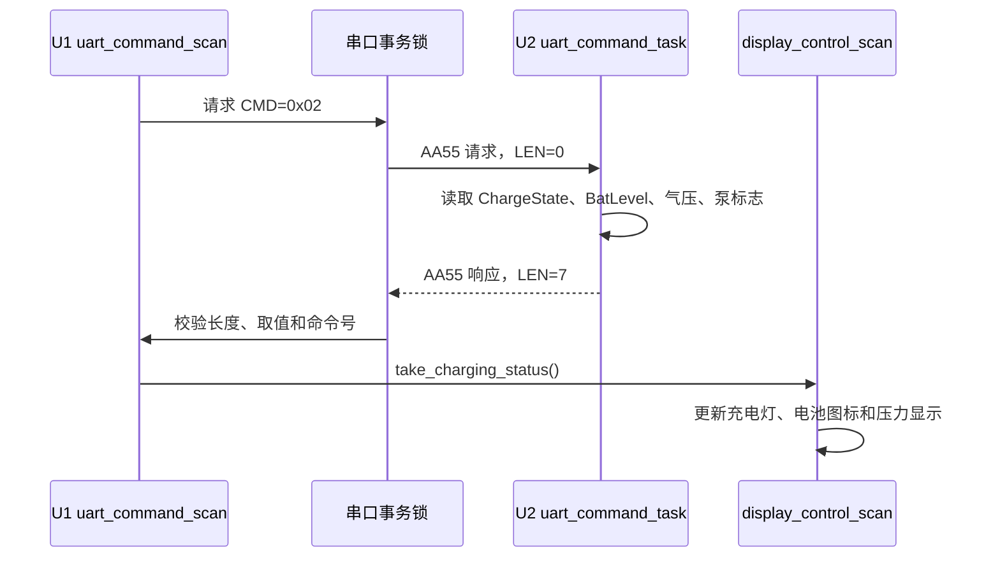
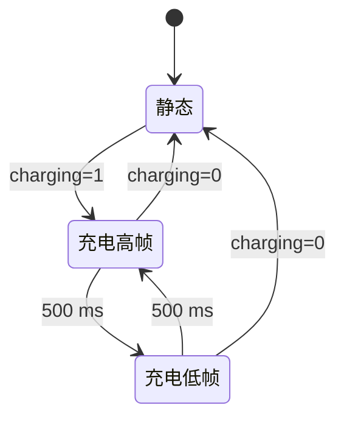

# U1/U2 状态协议与显示逻辑

## 1. CMD=0x02 的数据流

U1 是显示和交互主控，U2 是电池、充电和压力泵状态主控。U1 每 `1000 ms` 提交一次无载荷 `CMD=0x02` 查询；U2 直接从当前运行状态组装 7 字节响应。



U1 的事务锁覆盖“发送请求—等待返回—校验—解锁”全过程，返回等待超时为 `100 ms`。串口忙时，周期查询顺延；收到无效帧或超时不会覆盖最近一次有效状态。

## 2. CMD=0x02 响应载荷

| 偏移 | 长度 | 字段 | 取值 |
|---:|---:|---|---|
| 0 | 1 | `CHARGING_STATE` | `0=非充电`，`1=正在充电` |
| 1 | 1 | `BAT_LEVEL` | `0=满电`，`1=较高`，`2=较低`，`3=低电/空电` |
| 2 | 4 | `PRESSURE_PA` | 32 位无符号小端序，单位 Pa |
| 6 | 1 | `PUMP_STATE` | `0=停止`，`1=运行` |

U2 的 `CHARGING_STATE` 只有 `charge_get_state()==CHARGE_STATE_CHARGING` 时才置 1。USB 插入但电流非负的 `DISCHARGING` 状态，在协议中仍返回 0；但 U2 继续禁止电机启动。

U1 收到响应后检查：长度必须为 7，充电位必须为 0/1，电量必须不大于 3，泵状态必须为 0/1。合法数据写入缓存，并置位 `s_charging_status_pending`，由显示层在主循环中消费。

## 3. 电量编码到图标格数

U2 的数值越小越满，U1 图标的数值越大格数越多，所以 `display_control_driver.c` 使用：

```c
display_level = 3U - battery_level;
```

| U2 `BatLevel` | U1 `display_level` | 静态图标 |
|---:|---:|---|
| 0 | 3 | 外框 + 三格 |
| 1 | 2 | 外框 + 两格 |
| 2 | 1 | 外框 + 一格 |
| 3 | 0 | 仅外框 |

U1 的 `battery_icon_driver.c` 只接收 `0~3` 的“显示格数”，超范围会钳位为 3。这样可以把协议语义和 LED 矩阵的正向显示语义隔离开。

## 4. 充电动画

充电状态置 1 时，U1 每 `500 ms` 在两个显示格数之间切换；充电状态置 0 时立即恢复静态格数。

| 当前静态格数 | 充电动画高帧 | 充电动画低帧 |
|---:|---:|---:|
| 3 | 3 | 2 |
| 2 | 3 | 2 |
| 1 | 2 | 1 |
| 0 | 1 | 0 |



动画只改变当前 LED 矩阵显示帧，不改变 `battery_icon_get_level()` 返回的业务格数，也不改变 U2 的 `BatLevel`。

## 5. 显示层消费顺序

U1 `display_control_scan()` 的相关顺序为：

1. 调用 `battery_icon_scan()`，推进上一帧充电动画；
2. 调用 `uart_command_take_charging_status()` 读取最近一次有效 `CMD=0x02`；
3. 将 `BatLevel` 反向转换为 `display_level`；
4. 更新 `dc_led_set_charging()`；
5. 更新 `battery_icon_set_charging()` 和 `battery_icon_set_level()`；
6. 更新实际压力显示。

如果本轮没有新的合法响应，U1 保留最近一次有效的充电、电量和压力显示。

## 6. 与压力泵控制的关系

S1 短按不会直接依据 U1 本地缓存切换泵。U1 会先提交一次 `CMD=0x02` 查询；如果周期查询恰好已经在进行，则复用该事务。收到合法返回后：

- 返回泵运行，发送 `CMD=0x04` 暂停；
- 返回泵停止，发送 `CMD=0x03` 启动。

U2 收到 `CMD=0x03` 时再次检查 USB、低电保护、目标压力、模式和去皮状态；即使 U1 因通信滞后发起启动，U2 仍是最终安全裁决方。

## 7. CMD=0x05 休眠协议

`CMD=0x05` 无载荷，请求进入休眠；返回 1 字节状态：

| 值 | 宏 | 含义 |
|---:|---|---|
| 0 | `UART_COMMAND_SLEEP_READY` | U2 条件允许休眠 |
| 1 | `UART_COMMAND_SLEEP_BUSY` | USB、充电或泵状态不允许 |
| 2 | `UART_COMMAND_SLEEP_ERROR` | 预留错误码 |

U2 必须先把响应帧完整发送出去，再调用 `power_manager_commit_sleep()`；U1 只有收到 `READY` 才会关闭控制串口并进入 STOP。详细 GPIO 和 STOP 时序见 [02-休眠与唤醒逻辑](02-休眠与唤醒逻辑.md)。

## 8. 串口失败时的行为

| 场景 | U1 行为 | 显示行为 |
|---|---|---|
| 串口忙 | 本次查询顺延 | 保留旧值 |
| 100 ms 超时 | 释放事务锁 | 保留旧值 |
| CMD/长度/字段非法 | 丢弃本帧 | 保留旧值 |
| 合法 `CMD=0x02` | 写入缓存并置 pending | 下一轮显示扫描更新 |

这套处理确保一次通信异常不会把电量图标误清零，也不会因为无效响应误切换压力泵。
