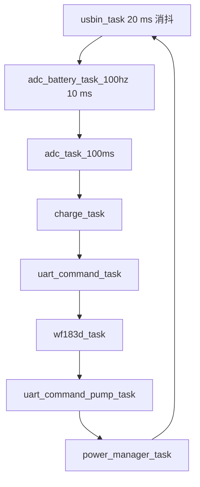
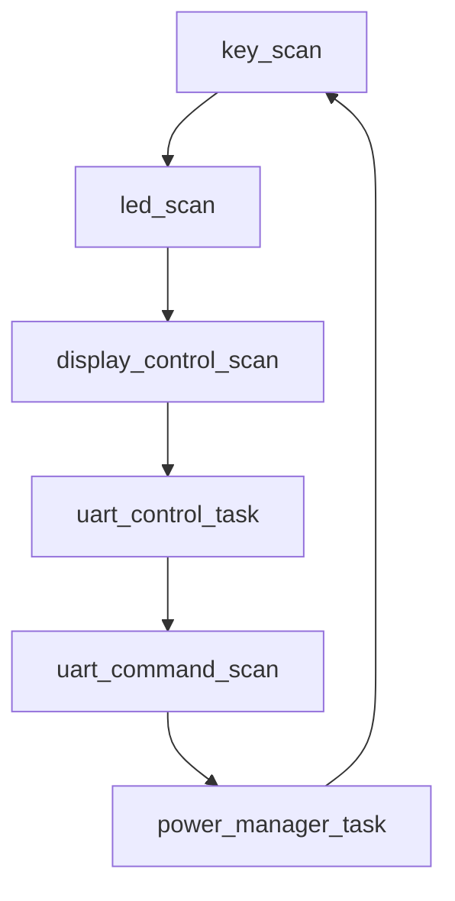

# 代码实现索引与验证清单

## 1. 入口文件和调用链

### U2 Control

| 文件 | 关键接口 | 职责 |
|---|---|---|
| `U2/control/Src/main.c` | `main()` | 初始化顺序和轮询调度 |
| `U2/control/Src/usbin.c` | `usbin_task()` | PA5 USB 输入消抖，更新稳定插入状态 |
| `U2/control/Src/adc.c` | `adc_battery_task_100hz()` | 电池/电流采样、平均和 `BatLevel` |
| `U2/control/Src/charge.c` | `charge_task()` | IP2326 输出、充电状态、低电锁存、超时 |
| `U2/control/Src/uart_command_driver.c` | `uart_command_task()` | 协议命令、泵启动拦截、CMD=0x02/CMD=0x05 |
| `U2/control/Src/power_manager.c` | `power_manager_task()` | U2 进入 STOP、PA5/PB7 唤醒和外设恢复 |
| `U2/control/Src/moto.c` | `moto_stop()` | 两路泵 PWM 停止和恢复 |

U2 主循环实际顺序：



### U1 Display

| 文件 | 关键接口 | 职责 |
|---|---|---|
| `U1/Display/Src/main.c` | `main()` | 按键、LED、协议和低功耗轮询 |
| `U1/Display/Src/key_driver.c` | `key_scan()` | 10 ms 采样、30 ms 消抖、短按/长按事件 |
| `U1/Display/Src/display_control_driver.c` | `display_control_scan()` | 消费按键和 CMD=0x02，更新显示 |
| `U1/Display/Src/uart_command_driver.c` | `uart_command_scan()` | 1 s 状态查询、事务锁、协议解码 |
| `U1/Display/Src/battery_icon_driver.c` | `battery_icon_scan()` | 电量格数和 500 ms 充电动画 |
| `U1/Display/Src/power_manager.c` | `power_manager_task()` | CMD=0x05 握手、U1 STOP、PA0/PB5 唤醒 |

U1 主循环实际顺序：



## 2. 关键状态变量

| 变量 | 所在模块 | 含义 |
|---|---|---|
| `s_battery_level` | U2 `adc.c` | 当前 0~3 反向电量档位 |
| `s_battery_low` | U2 `adc.c` | 最近完整平均是否落入低电档 |
| `charge_state` | U2 `charge.c` | IDLE/CHARGING/DISCHARGING/DISABLED |
| `low_protection_active` | U2 `charge.c` | 低电锁存 |
| `g_uart_pump_running` | U2 `uart_command_driver.c` | U2 认为压力泵正在运行 |
| `s_charging_status_pending` | U1 `uart_command_driver.c` | 是否有新的合法 CMD=0x02 |
| `s_battery_level` | U1 `uart_command_driver.c` | 最近一次 U2 返回的 BatLevel |
| `s_level` | U1 `battery_icon_driver.c` | 正向显示格数 |
| `s_charging` | U1 `battery_icon_driver.c` | 当前图标动画开关 |
| `s_sleep_requested` | U1 `power_manager.c` | U1 已请求进入休眠 |
| `s_wake_flags` | U1/U2 `power_manager.c` | 本地/共享线唤醒原因 |

## 3. 典型场景追踪

### 场景 A：未插 USB，电量逐步下降到低电

```text
PA5 消抖为 0
 -> 电机未运行时使用 normal 阈值
 -> 64 个二点平均完成，adc_level=3
 -> charge_task 置位 low_protection_active
 -> 下一次 CMD=0x03 被拒绝
 -> uart_command_enforce_motor_protection() 停止两路泵
 -> CMD=0x02 返回 CHARGING=0、BAT_LEVEL=3
 -> U1 显示外框，不显示电量格
```

### 场景 B：插入 USB，电流为负

```text
PA5 原始高电平保持 20 ms
 -> usbin_is_inserted()=1，IP2326 打开
 -> PA4 电流换算为负值
 -> charge_state=CHARGING
 -> 清除低电锁存，但 USB 仍禁止电机启动
 -> 电量窗口改用 charge 阈值，BatLevel 只允许向 0 变化
 -> CMD=0x02 返回 CHARGING=1
 -> U1 图标进入 500 ms 充电动画
```

### 场景 C：U1 长按进入 STOP

```text
S1 连续按下 >=800 ms
 -> U1 关闭显示并置 s_sleep_requested
 -> 等待释放
 -> 每 1 s 发送 CMD=0x05
 -> U2 检查 USB/泵/充电条件并返回 READY 或 BUSY
 -> READY 时双方关闭外设、配置 EXTI、WFI
```

### 场景 D：STOP 中插入 USB

```text
U2 PA5 上升沿唤醒
 -> 恢复时钟、USB、ADC、串口和泵驱动
 -> 等待 PA5 消抖确认
 -> 打开 IP2326
 -> PB7 拉高 5 ms
 -> U1 PB5 上升沿唤醒
 -> U1 恢复并打开显示，显示充电状态
```

## 4. 建议的实机验证清单

### 电池和充电

- [ ] 断开 USB 时 PA5 默认低，插入时稳定 20 ms 后 PA2 才打开。
- [ ] 电流检测低于零点时，`CMD=0x02` 的充电位为 1；零电流或正电流时为 0。
- [ ] 观察约 1.28 s 一个完整电量窗口，确认每次最多变化一级。
- [ ] 在充电/电机运行/静置三种上下文下分别验证三组 ADC 阈值。
- [ ] 低电达到 `BatLevel=3` 后启动命令被拒绝，且运行中的泵立即停止。
- [ ] USB 插入能清除低电锁存，但 USB 插入期间仍不能启动泵。
- [ ] 充电连续超过约 6.14 h 时，电量按一级一级向 0 推进。

### U1/U2 协议和显示

- [ ] `CMD=0x02` 载荷长度固定为 7，字段按小端序解析。
- [ ] `BatLevel=0/1/2/3` 分别显示 3/2/1/0 格。
- [ ] 四个档位在充电时分别按 3↔2、3↔2、2↔1、1↔0 格闪烁。
- [ ] 串口超时或非法帧不会清零图标，也不会误切换压力泵。

### 休眠和唤醒

- [ ] S1 长按后，按住不放不会立即进入 STOP；释放后才允许握手。
- [ ] U2 有 USB、充电或泵运行时返回 BUSY，U1 不进入 STOP。
- [ ] STOP 前检查共享线为低，PA0/PA5/PB5/PB7 的上下拉和 EXTI 边沿正确。
- [ ] S1 唤醒只唤醒 U1 并脉冲通知 U2，不误触发泵或显示切换。
- [ ] USB 唤醒等待 20 ms 消抖后才脉冲通知 U1，并点亮充电界面。
- [ ] 用示波器确认 `WK_UP` 高脉冲约 5 ms，且脉冲后线路回到低电平。
- [ ] 用功耗仪确认 STOP 电流满足硬件目标。

## 5. 当前实现的注意事项

- 上电电池初值的 128 次采样是紧凑连续读取，和运行时 10 ms 节拍不同。
- `CHARGE_STATE_FAULT`、`CMD=0x05` 的 ERROR 返回值属于预留能力，当前主流程未使用故障状态机。
- U2 的休眠条件函数目前不检查传感器校准或串口业务队列；如果产品要求更严格的休眠门槛，应在 `power_manager_can_sleep()` 集中补充。
- STOP 电流、共享线电平和实际按键复用效果不能仅凭静态代码确认，必须在目标板上测量。
