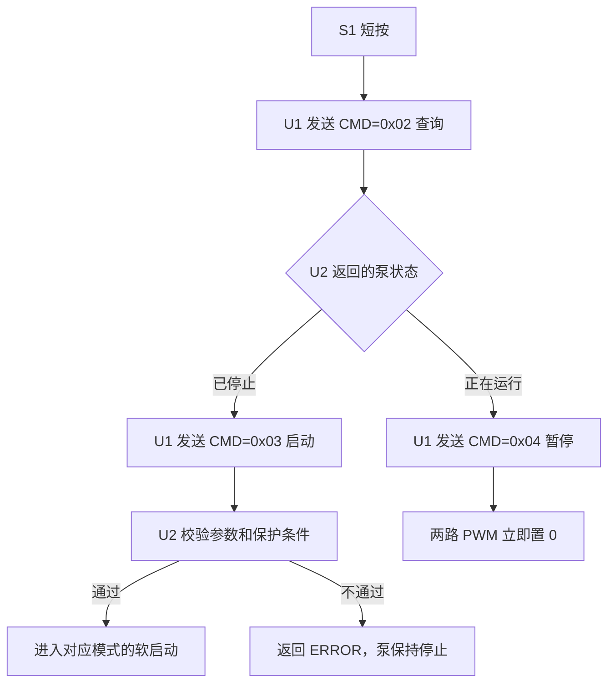

# 压力泵控制与保护逻辑

## 1. 文档目的

本文档说明当前 U1 显示板与 U2 控制板之间的压力泵控制逻辑，包括：

- 用户如何开启和暂停压力泵；
- 三种模式分别使用哪一路泵；
- 启动前需要满足的条件；
- 运行中何时自动停泵；
- 当前已实现、临时关闭和尚未实现的保护功能。

本文档以 `U1/Display` 和 `U2/control` 当前本地源代码为准。

## 2. 系统分工和硬件通道

| 模块 | 职责 |
|---|---|
| U1 显示板 | 处理按键、模式、单位和目标压力，通过半双工串口发送控制命令 |
| U2 控制板 | 检查启动条件，读取压力传感器，执行泵状态机和本地保护 |
| WF183D | 通过 U2 PB4/PB5 软件串口读取温度和压力 |

U2 两路泵输出：

| 通道 | U2 引脚 | 用途 | PWM |
|---|---|---|---|
| MOTO1 | PA0 / TIM1_CH1 | 低压泵 | 500 Hz，逻辑占空比 `0~1000` |
| MOTO2 | PA1 / TIM1_CH2 | 高压泵 | 500 Hz，逻辑占空比 `0~1000` |

`0` 表示关闭，`750` 表示 75% PWM，`1000` 表示 100% 输出。当前驱动按高电平有效配置。

## 3. 面板如何开启压力泵

### 3.1 设置目标

1. 短按 S5 选择模式：皮筏艇、充气床、轮胎循环切换。
2. 短按 S6 切换压力单位。
3. 短按 S4 增加目标压力，短按 S2 减少目标压力。
4. U1 发送命令前会将显示值统一换算为 Pa。

### 3.2 S1 短按切换运行状态

S1 短按不是盲目反转 U1 本地缓存，而是先查询 U2 的实际状态：



S1 长按用于关闭显示并申请 U1/U2 休眠，不是泵启停命令。泵正在运行时，U2 会拒绝进入休眠。

## 4. U1/U2 泵控制协议

| CMD | 作用 | 请求载荷 | U2 返回 |
|---:|---|---|---|
| `0x02` | 查询状态 | 无 | 7 字节：充电、电量、压力、泵状态 |
| `0x03` | 启动泵 | 5 字节：目标压力 + 模式 | `0=停止`、`1=运行`、`2=错误` |
| `0x04` | 暂停泵 | 无 | `0=已停止`，非法载荷返回错误 |

`CMD=0x03` 的 5 字节载荷：

```text
Byte[0..3]  目标压力，uint32 小端，单位 Pa
Byte[4]     模式：0=皮筏艇，1=充气床，2=轮胎
```

## 5. U2 允许启动的条件

U2 只有在以下条件全部满足时才启动泵：

| 检查项 | 允许条件 | 不满足时 |
|---|---|---|
| USB 状态 | USB 未插入 | 拒绝启动 |
| 低电保护 | 低电锁存未生效 | 拒绝启动；本地存在临时关闭此项的未提交测试配置 |
| 目标压力 | `1~99,900,000 Pa` | 返回 `ERROR` |
| 模式 | `0~2` | 返回 `ERROR` |
| 压力去皮 | WF183D 已完成 10 次有效上电采样 | 返回 `ERROR` |

目标压力会加上上电去皮偏移后保存，与传感器内部压力值在同一数值域比较。用户界面和 `CMD=0x02` 返回的压力仍是减去去皮值后的压力。

## 6. 三种模式的泵控制

| 模式 | 协议值 | 当前控制逻辑 |
|---|---:|---|
| 皮筏艇 / RAFT | `0` | 低压泵起压，超过 `2758 Pa` 后停 1 s，再切换高压泵 |
| 充气床 / AIR_BED | `1` | 只使用高压泵 |
| 轮胎 / TIRE | `2` | 只使用高压泵 |

### 6.1 皮筏艇模式

1. 启动时实时压力 `<= 2758 Pa`：
   - MOTO1 低压泵先执行 23 ms 软启动；
   - 低压泵随后以 100% 运行；
   - 当压力 `> 2758 Pa` 时，低压泵关闭；
   - 两路泵保持关闭 1000 ms；
   - MOTO2 高压泵执行 256 ms 软启动；
   - 高压泵随后以 100% 运行。
2. 启动时实时压力已经 `> 2758 Pa`：跳过低压泵，直接执行高压泵 256 ms 软启动。

### 6.2 充气床和轮胎模式

MOTO1 始终关闭，MOTO2 高压泵先执行 23 ms 软启动，随后以 100% 持续运行。

> 当前代码只将 RAFT 模式映射为“低压泵切高压泵”流程。如果产品定义中充气床也应先用低压泵，需要另外修改模式映射。

## 7. 当前软启动时序

软启动均分为 4 个阶段：前 3 个阶段为 75% PWM，第 4 个阶段为 0%，结束后转为 100% 持续输出。

| 软启动类型 | 阶段时间 | 总时间 |
|---|---|---:|
| 普通软启动 | 6 ms + 6 ms + 6 ms + 5 ms | 23 ms |
| 皮筏艇切换后的高压软启动 | 64 ms + 64 ms + 64 ms + 64 ms | 256 ms |

注意：这是当前代码实现的分阶段脉冲，不是占空比从 0% 线性上升到 100% 的斜坡软启动。

具体波形和状态机详见 [05-压力泵软启动流程](05-压力泵软启动流程.md)。

## 8. 何时自动停泵或拒绝运行

### 8.1 已实现的停泵条件

| 触发条件 | 启动前 | 运行中 | 实际动作 |
|---|---|---|---|
| 收到 `CMD=0x04` | - | 有效 | 清除运行标志，两路 PWM 立即置 0 |
| 实时压力达到或超过目标 | - | 有效 | 清除运行标志，两路 PWM 置 0 |
| USB 插入 | 拒绝启动 | 立即停泵 | U2 本地执行，不依赖 U1 轮询 |
| 低电保护锁存 | 拒绝启动 | 立即停泵 | 正式设计已有逻辑；本地未提交测试配置临时禁用了此项 |
| 泵状态机不匹配 | - | 有效 | 先关闭两路输出并回到初始状态 |
| U2 初始化或进入 STOP | - | 有效 | 停止 PWM，休眠时将泵引脚转为模拟无上下拉 |

所有正常停泵动作都会执行：

```text
MOTO1 PWM = 0
MOTO2 PWM = 0
泵状态机 = IDLE
软启动阶段计数 = 0
```

WF183D 当前每 1000 ms 采集一次压力，因此“达到目标压力”停泵的判断粒度约为 1 s。实物上需要验证此采样周期带来的压力过冲是否可接受。

### 8.2 低电保护的正式设计

启用低电保护时，U2 每 10 ms 采样电池与电流，每两个样本先平均，再累计 64 组平均结果进行电量分档。泵运行时使用工作态阈值；最新窗口被判为最低电量档，且电量状态已进入 `3` 档时，低电保护锁存。

- 锁存后新的启动命令被拒绝；
- 若泵已在运行，U2 主循环会清除运行标志并停止两路泵；
- USB 插入后清除低电锁存，但 USB 插入期间仍禁止泵运行。

## 9. 本地未提交测试配置警告

当前本地文件 `U2/control/Inc/charge.h` 中存在：

```c
#define CHARGE_DISABLE_LOW_PROTECTION 1U
```

该配置的实际效果是每轮强制清除 `low_protection_active`。因此当前本地程序中：

- USB 插入禁止启泵和运行中停泵仍然有效；
- 电池低电锁存、低电拒绝启动和低电运行中停泵均不生效。

这是临时测试开关，不应作为正式量产配置，因此本次更新不会将该本地测试改动提交到 GitHub。正式验证低电保护时，应保持仓库默认的低电锁存逻辑。

## 10. 当前尚未实现的保护

以下采样或状态虽然存在，但当前没有接入泵的停机判断：

| 未实现项 | 当前情况 | 风险 |
|---|---|---|
| 电机电压过压 | 只更新 `motor_mv`，没有阈值和停泵逻辑 | 驱动供电异常时软件不会停机 |
| 12 V 输入过压/欠压 | 只更新 `input_12v_mv`，没有阈值和停泵逻辑 | 输入电源异常时软件不会停机 |
| 过流/堵转 | 采集了电流，但只用于判断充电方向 | 泵堵转或驱动过流时无软件停机 |
| 最大连续运行时间 | 没有总运行超时计时器 | 压力不上升时可能长时间运行 |
| 压力不升/泄漏检测 | 没有压力斜率判断 | 漏气或泵效率异常时不会停机 |
| WF183D 运行中通信失败停泵 | 只记录错误状态和计数，保留上一次有效压力 | 压力不再更新时，泵仍可能继续运行 |

WF183D 通信失败是当前最需要关注的压力保护缺口：如果故障发生前的最后压力低于目标值，现有逻辑不会因传感器超时或 CRC 错误而自动停泵。

## 11. 休眠联动

- 泵运行标志为 `1` 时，U2 的 `power_manager_can_sleep()` 返回不允许休眠。
- U2 只在 USB 未插入、泵已停止、且不在充电时返回休眠 READY。
- 真正进入 STOP 前，U2 会停止 PWM、ADC、串口和充电输出，并将非唤醒 GPIO 转为低漏电模式。

## 12. 建议的实物验证清单

| 编号 | 验证场景 | 预期结果 |
|---:|---|---|
| 1 | 目标压力为 0 时按 S1 | U2 拒绝启动，两路 PWM 为 0 |
| 2 | 皮筏艇模式、起始压力低于 2758 Pa | MOTO1 先运行，过阈值后停 1 s，再启动 MOTO2 |
| 3 | 皮筏艇模式、起始压力高于 2758 Pa | MOTO1 不动，MOTO2 直接软启动 |
| 4 | 充气床和轮胎模式 | 只有 MOTO2 输出 |
| 5 | 泵运行中达到目标压力 | 两路 PWM 置 0，查询状态为停止 |
| 6 | 泵运行中短按 S1 | U1 查询后发送暂停，两路 PWM 置 0 |
| 7 | USB 未插入时启泵，运行中插入 USB | USB 消抖确认后立即停泵 |
| 8 | USB 已插入时按 S1 启动 | U2 返回错误，泵不启动 |
| 9 | 启用低电保护后进行低电测试 | 低电锁存后停泵，再次启动被拒绝 |
| 10 | 泵运行时申请休眠 | U2 返回 BUSY，不进入 STOP |
| 11 | 泵运行中断开 WF183D 通信 | 记录当前实际表现；现有程序不会因此主动停泵 |

## 13. 代码实现索引

| 功能 | 文件 |
|---|---|
| U1 按键和泵切换入口 | `U1/Display/Src/display_control_driver.c` |
| U1 状态查询和启动/暂停事务 | `U1/Display/Src/uart_command_driver.c` |
| U2 泵命令校验、状态机和停泵逻辑 | `U2/control/Src/uart_command_driver.c` |
| PWM 参数和两路泵驱动 | `U2/control/Src/moto.c`、`U2/control/Inc/moto.h` |
| USB 与低电运行许可 | `U2/control/Src/charge.c`、`U2/control/Inc/charge.h` |
| 电池采样和分档 | `U2/control/Src/adc.c` |
| WF183D 采样、去皮和故障记录 | `U2/control/Src/wf183d.c` |
| 休眠条件与停泵后休眠 | `U2/control/Src/power_manager.c` |
