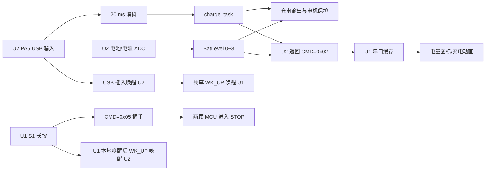

# U1/U2 电池、充电与唤醒逻辑文档

本文档组按“先看总览、再看单功能、最后查代码”的顺序整理当前工程实现。内容以 `U1/Display` 和 `U2/control` 当前源代码为准，流程图使用 Mermaid 编写。

## 文档导航

| 文档 | 内容 |
|---|---|
| [01-电池与充电控制逻辑](01-电池与充电控制逻辑.md) | U2 电池 ADC 采样、四级电量、充电状态、超时、低电保护和电机拦截 |
| [02-休眠与唤醒逻辑](02-休眠与唤醒逻辑.md) | U1/U2 进入 STOP、`CMD=0x05` 握手、PA0/PA5 唤醒和共享 `WK_UP` 脉冲 |
| [03-状态协议与显示逻辑](03-状态协议与显示逻辑.md) | `CMD=0x02` 数据格式、U1/U2 串口事务、图标格数转换和充电动画 |
| [04-代码实现索引与验证清单](04-代码实现索引与验证清单.md) | 主循环调用链、源文件索引、典型场景和实机验证项目 |

## 一页总览

## 最重要的约定

1. 电量不是百分比，而是 U2 电池端 ADC 电压分档：`0=满电`、`1=较高`、`2=较低`、`3=低电/空电`。
2. U2 是电池和充电状态的唯一业务来源。U1 只读取 `CMD=0x02`，不读取电池 ADC。
3. 只有“USB 已消抖插入且电流为负”才返回充电中；USB 插入但电流不为负时，U2 仍禁止电机，但协议充电位为 0。
4. U1 图标使用正向“格数”，因此收到 `BatLevel` 后必须计算 `display_level = 3 - BatLevel`。
5. 低电停机和充电期间禁止启动由 U2 本地执行，不依赖 U1 是否在线或是否刚刚轮询到状态。
6. 休眠唤醒有两个本地源：U1 `PA0/S1`、U2 `PA5/USBIN`；两边通过共享 `WK_UP` 线互相通知。
